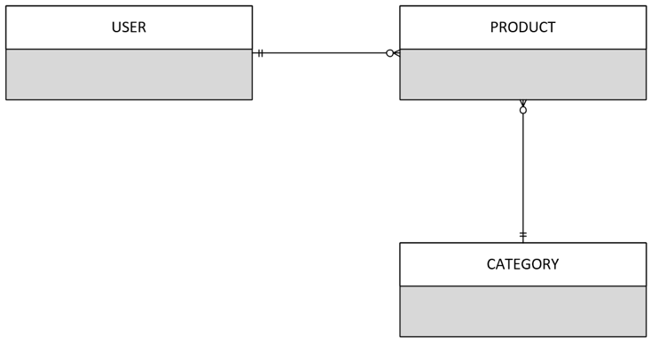
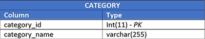
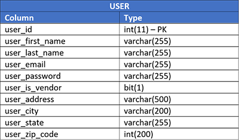

This was a term project for CSE 345 - Database Design and Implementation. My team consisted of myself, Michael Looka, and Mark Easterly. Our final report can be seen below.

# Online Store - Database Design and Implementation

## Problem Description
Our group was tasked with creating an online store. This website allows a user to view and purchase available products sorted by different categories. The website is connected to a MySQL database which stores data regarding product information, users and categories. This site also includes a shopping cart which holds all of a customer’s selections. The shopping cart is updatable throughout each user’s session on the website. Additionally, to complete a transaction, the customer must to register and login. A transaction, in this case, is merely an inventory update in the database (decrements the stock by one). Moreover, registered users are also able to sell products through the website, and check his or her products that are on the market.

All of the above requirements have been met. Some additional features have also been implemented. These features include a “My Account” page; the ability for a seller to update the stock, description, image, and price of his or her products; and a responsive client side design.

## Database Design
The basis of this website design is the database. It is the driving source for all of the data storage, and allows for dynamic updates to the website based on the data contained within the it. Since this project is simply a prototype of an online store, a basic database design was created and implemented. This design employs three tables (PRODUCT, USER, and CATEGORY) to perform the requirements listed in the above section.

### Business Rules
The following business rules were created to form the basis of the database design: Each product may be sold by one user, who must be a seller. Each seller may sell one or multiple products. Each product may belong to one category. Each category may have multiple products in it. Each user may buy many products.

### Entity Relationship Diagram
The Entity Relationship Diagram (ERD) below was created in accordance with the above business rules. In this diagram, we see a one to many (1:M) relationship between the USER and PRODUCT tables. Additionally, we see a one to many (1:M) relationship between the CATEGORY and PRODUCT entities.

### Entity Definitions
The tables below show the attributes for the PRODUCT, USER, and CATEGORY tables. They also list the data types and primary keys/foreign keys for each of the tables.

 

## Implementation

### Basic Implementation Strategy
To implement this project, we used MySQL and PHP for the back-end. HTML, JavaScript, and Bootstrap were used for development of the front-end. The code and database are both hosted in the [Cloud9](https://c9.io/) hosting environment. 

### Model, View, Controller (MVC) Backend
To organize our back end code, we implemented a model-view-controller (MVC) framework for our code. Through this framework, the code is organized in such a way that all views are stored in one place, processing pages are stored in another, and model objects are stored in a separate file. This allows for an object oriented approach to coding the website, and enables code reusability, while enhancing readability of our code.

The “model” area of the code contains all of the models and object types for the tables. These are essentially PHP objects which store the attributes of one entry. Each entry thus can be translated into a PHP object, or created from a PHP object. This model is manipulated by the controller, and displays information back to the view. Our model contains objects for USER, PRODUCT, and CATEGORY.

The view is updated with information from the model, and is the part of the graphical user interface that the user of the tool sees. Our tool employs the use of multiple views. These include the homepage, cart page, product page, registration page, login page, my account page, and sell page. When a user submits information on these pages, it is sent to the controller, which manipulates the model and updates the database.

When the user makes a submission on a view page, it is sent to the respective controller. The controller then manipulates the model and makes calls to the repository to update the database with this new model. More information regarding the repository and database calls from PHP is available in the section below. Additionally, the controller is responsible for providing information to the view pages. For example, when the product view for a certain category loads, the controller provides the view with all products stored in the database in that category. The view is then able to loop through products in order to display them on the page. As discussed in the requirements as well, we were required to implement the functionality for users to store a shopping cart. This is done by using session variables in the PHP code, and is updated accordingly in the controller.

### Integration of the Database and Code
With the database design created and the MVC model for implementation, we were able to easily integrate the database and the code together. With the MVC structure, we were able to create global variables within the code. When a session is first loaded, a connection with the database is established, and is stored as a global variable in the PHP. This variable is then used whenever any code must establish a connection with the database.

As aforementioned, each controller makes calls to the respective repository. Each repository includes multiple functions that can be used from the controller to make database calls. These include INSERT, UPDATE, DROP, and SELECT query statements in order to send and retrieve data to the database. Each of these functions uses the connection variable to connect to the database. SELECT statements return arrays when then bind to database objects in order to return an object when the function is called.

### Results and Future Work
Given the database structure above and implementation methods provided above, we were able to meet all of the requirement for the project. Additionally, some extra features such as the my account page were added to the original design. Though the database design and implementation strategy used met all of the provided requirements for the project, there is much room for future improvement of our project. These improvements may include the addition of more tables including a transaction history and line table to store transaction history when users make purchases. With our MVC structure and the current database design, additions such as this are very simple and would not take long to do. This adaptability of the application is an important part of the implementation, as it allows for flexibility and the addition of more features to the project.

## Contributions
We divided up the roles for this project in the following way:

**Michael Looka** wrote the business rules for the original design. He also created the original ERD with Mark. He set up the database in cloud 9 and created the USER table. Michael also set up the MVC framework for the backend implementation. Additionally, he wrote the code that connects the PHP back end to the database. Michael also implemented the checkout functionality for the shopping cart. To do this, he wrote SQL queries in the PHP repositories to update the product stock, and updated session variables to clear the cart. He also wrote the database scripts and the README for the final implementation submission. Finally, he worked on the presentation slides and the final report.

**Parth Patel** created the original website mock-ups. He was responsible for the front-end design and development. He created all the user interface screens: homepage, cart page, product page, registration page, login page, my account page, and sell page. This involved using HTML, CSS, and Bootstrap. He also implemented some dynamic presentation of information on the view pages using PHP and HTML. Finally, he worked on the presentation slides and the report.

**Mark Easterly** created the original ERD with Michael. He created the PRODUCT and CATEGORY tables in the database. He set up the repository for each view with database queries. He wrote dynamic database queries which adapt to page submission forms from views, which are stored in repositories called from the controller. For the controller pages, Mark created functions for each action on the view pages.
